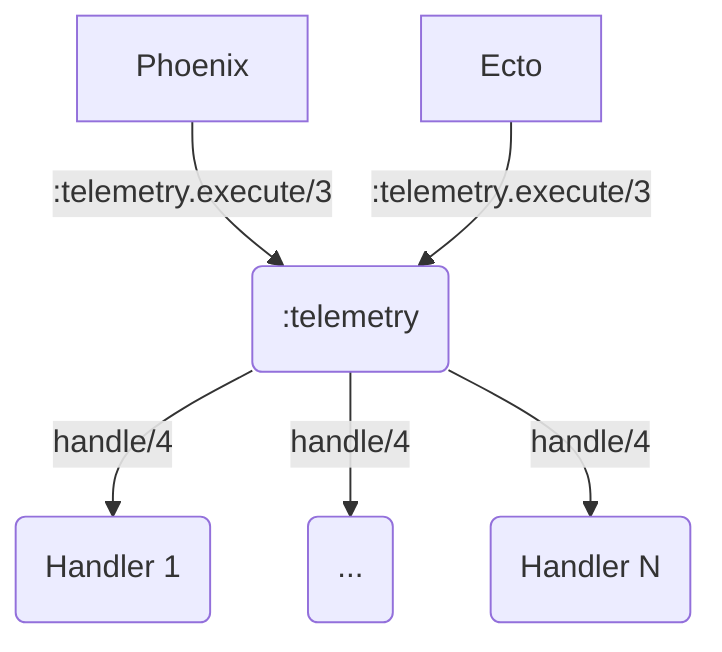
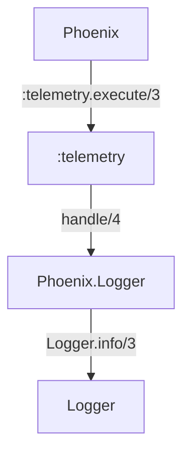
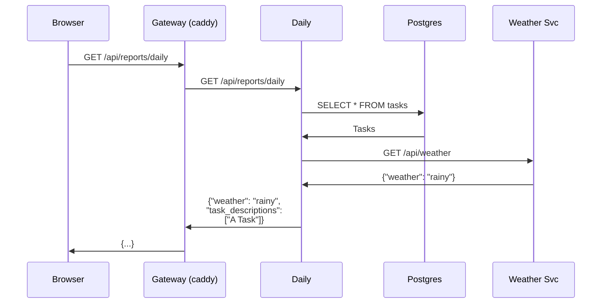
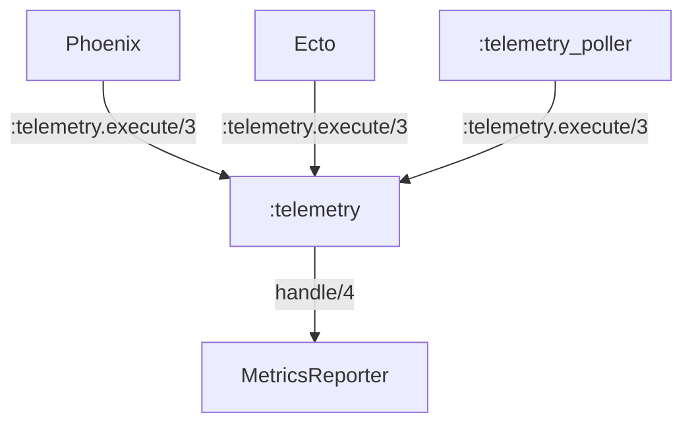
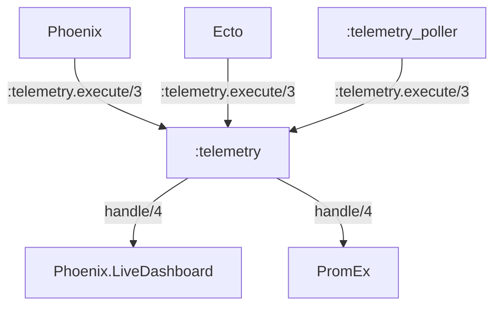
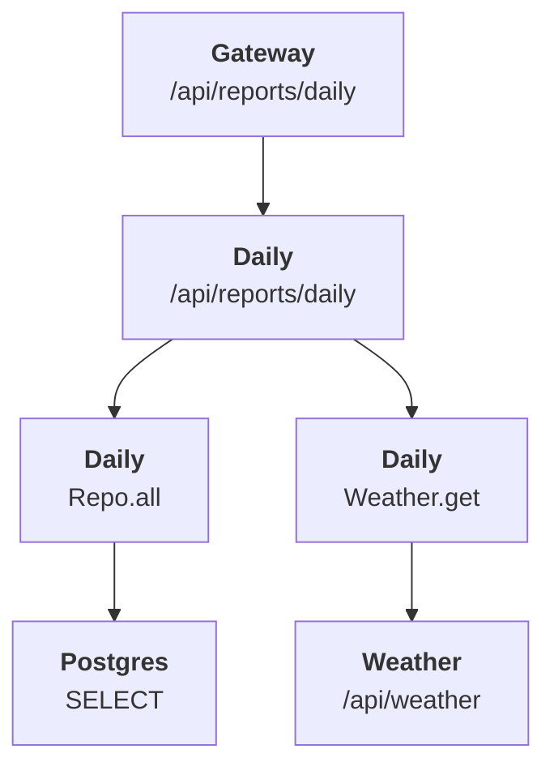

```mermaid
graph TD
    P[Phoenix] -->|:telemetry.execute/3| T(:telemetry)
    E[Ecto] -->|:telemetry.execute/3| T
    T -->|handle/4| H1(Handler 1)
    T -->|handle/4| H.(...)
    T -->|handle/4| H2(Handler N)
```

```mermaid
graph TB
  P[Phoenix] --> |:telemetry.execute/3| T[:telemetry]
  T --> |handle/4| PL[Phoenix.Logger]
  PL --> |Logger.info/3| Logger
```

```mermaid
sequenceDiagram
  participant B as Browser
  participant G as Gateway (caddy)
  participant D as Daily
  participant P as Postgres
  participant W as Weather Svc

  B ->> G : GET /api/reports/daily
  G ->> D : GET /api/reports/daily
  D ->> P : SELECT * FROM tasks
  P ->> D : Tasks
  D ->> W : GET /api/weather
  W ->> D : {"weather": "rainy"}
  D ->> G : {"weather": "rainy", <br/> "task_descriptions": <br/>["A Task"]}
  G ->> B : {...}
```

```mermaid
graph TB
  P[Phoenix] --> |:telemetry.execute/3| T[:telemetry]
  Ecto -->|:telemetry.execute/3| T
  :telemetry_poller -->|:telemetry.execute/3| T
  T --> |handle/4| MetricsReporter
```

```mermaid
graph TB
  P[Phoenix] --> |:telemetry.execute/3| T[:telemetry]
  Ecto -->|:telemetry.execute/3| T
  :telemetry_poller -->|:telemetry.execute/3| T
  T --> |handle/4| Phoenix.LiveDashboard
  T --> |handle/4| PromEx
```

```mermaid
graph TB
  G[<b>Gateway</b><br/>/api/reports/daily] --> D[<b>Daily</b><br/>/api/reports/daily]
  D --> DR1[<b>Daily</b><br/>Repo.all]
  DR1 --> P[<b>Postgres</b><br/>SELECT]
  D --> DR2[<b>Daily</b><br/>Weather.get]
  DR2 --> W[<b>Weather</b><br/>/api/weather]
```