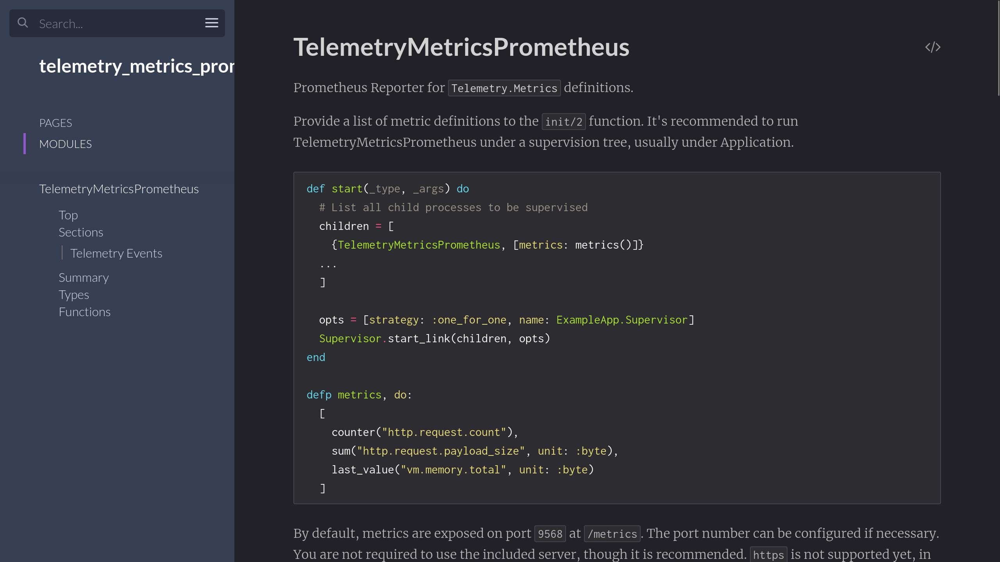

# Observable Elixir

---

# Agenda

- What is Observability
- Event Logs
- Metrics
- Traces

And we will be talking a lot about `:telemetry`

<!-- It's going to be intense -->
<!-- Will throw a bunch of words -->
<!-- There is a demo repo so you can check code afterwards -->

---

# Bernardo Amorim

## Software Engineer @ Slab.com

---

# What is Observability?

---

According to Wikipedia

> Observability is a measure of how well internal states of a system can be
> inferred from knowledge of its external outputs.

<!-- Word from Control Theory -->
<!-- What do we want to know about the system? -->

---

We want to:

- Understand whether the system is healthy or not.
- Debug what went or is going wrong during crisis.
- Find areas for improvement.

---

# The Demo App for this presentation

## [github.com/bamorim/observable-elixir-daily](https://github.com/bamorim/observable-elixir-daily)

---


---

<video src="./videos/demo-observable-elixir.webm" controls width="100%"></video>


---


---

# Agenda

- ~~What is Observability~~
- **Event Logs**
- Metrics
- Traces


---

# Event Logs

- Things happen in your system.
- Logs are a way for externalization.
- Examples:
  - HTTP Request Handled.
  - Database Query Executed.
  - Background Job Executed.

---

# Metadata

Common data

- Duration.
- Response Status Code.
- Path / Route.

---

# Similar to `:telemetry` events

---


--- 

# `:telemetry` events

```elixir
@type event() :: {event_name(), metadata(), measurements()}

@type event_name() :: [atom(), ...]
@type metadata() :: map()
@type measurements() :: map()
```

---


---

# `:telemetry` spans

- Has a start and an end.
- `:telemetry` defines a standard convention with 3 events:
  - `:start` with `:system_time` measurement.
  - `:stop` and `:exception` with `:duration` measurement.

---

# `:telemetry` span example

- `[:phoenix, :endpoint, :start]` when the request starts.
- `[:phoenix, :endpoint, :stop]` when the requests finishes successfully.
- `[:phoenix, :endpoint, :exception]` when an exception happens.

---

# Logs are just `:telemetry` events that are externalized


---

# My problem with Phoenix default logging


<!-- Data divided across lines -->
<!-- Hard for a machine to process it -->

---

# We can fix it

- Disable default Phoenix Logger.
- Implement custom logger by listening to telemetry events.
- Implement custom log formatter using a structured format (Logfmt or JSON).


---

# Implement in Elixir with Libraries

Many libraries for JSON Logging

- LoggerJSON
- Ink

---

# Implement in Elixir with Libraries

I'm open sourcing some internal libraries for logging we were using:

- [github.com/bamorim/telemetry_logger](https://github.com/bamorim/telemetry_logger)
- [github.com/bamorim/structured_logger](https://github.com/bamorim/structured_logger)

---

# Install the libraries

```elixir
  defp deps do
    [
      # Add the following deps
      {:telemetry_logger, github: "bamorim/telemetry_logger"},
      {:structured_logger, github: "bamorim/structured_logger"}
    ]
  end
```

Then run `mix deps.get`

---

# Switch to the new logger and formatter

```elixir
# Disable Phoenix Logger
config :phoenix, logger: false

# Set the formatter and allow all metadata
config :logger, :console,
  format: {StructuredLogger, :format},
  metadata: :all
```

```elixir
# Add to your MyApp.Application.start/2
TelemetryLogger.attach_loggers([
  {TelemetryLogger.PlugLogger, router: MyAppWeb.Router}
])
```

---


---

# Grafana, Loki and LogQL are awesome


  
---

# Logs Tips

- **Do** use structured logging.
- **Don't do** "print-debugging".
- **Do** take advantage of log levels.
- **Do** allow your system to change log level without redeploying.
- **Don't** nest fields in your logs.

---

# Logs help with debugging, but...

## How to check if the system is healthy?

- Requests/second.
- Average (and other percentiles) latency.
- Memory and CPU usage.

---

# Agenda

- ~~What is Observability~~
- ~~Event Logging~~
- **Metrics**
- Traces


---

# Metrics

## Numerical values sampled over time

---

# Metrics give you a high-level view of your system


- Useful both on a technical level (e.g. memory usage) or domain level (e.g. total count of payments processed).
- Great for visualizations.

---


---

# Metrics are cheap and fast to process

- Complexity is only dependent on number of timeseries and sample frequency.
- Great for alerting.
- Great for long term storage.

---

# Metrics - Data Model

```elixir
@type timeseries() :: {metric_id(), [sample()]}

@type metric_id() :: {metric_name(), metric_labels()}
@type sample() :: {sample_value(), timestamp()}

@type metric_name() :: String.t()
@type metric_labels() :: %{String.t() => String.t()}
@type sample_value() :: float()
@type sample_timestamp() :: integer()
```

---

# Computing metrics from `:telemetry` events

- `Plug.Telemetry` emits `[:phoenix, :endpoint, :stop]` events.
- We can count the number of events emitted and aggregate into the "total number of requests".

---


---

## `Telemetry.Metrics`

- Language for defining `:telemetry` based metrics.
- Define 5 different metric types (counter, distribution, last value, sum and summary).
- Metric Reporters attach to events and aggregate them.


---


---

```elixir
defmodule DailyWeb.Telemetry do
  use Supervisor
  import Telemetry.Metrics

  # ...

  def metrics do
    [
      # Phoenix Metrics
      summary("phoenix.endpoint.stop.duration",
        unit: {:native, :millisecond}
      ),
      summary("phoenix.router_dispatch.stop.duration",
        tags: [:route],
        unit: {:native, :millisecond}
      ),
      # ...
    ]
  end
end
```

---

# Limitations of LiveDashboard

- Metrics are not persisted.
- If you have multiple apps it will be hard to consolidate visualizations and data.
- Only works for Elixir.

---


---

# Prometheus

- Open-source monitoring and alerting system.
- A multi-dimensional data model for time-series data.
- PromQL: query language.
- Data collection via **pull** over simple HTTP protocol.

---

# Pull vs Push

- Prometheus is Pull, that is, Prometheus controls when to ask for metrics.
  - Improves back-pressure (if Prometheus is overloaded it can delay the sampling).
- Your app just need to:
  - Keep last values for metrics.
  - Be able to report them when Prometheus request (in a specific format).

---

# Prometheus Exposition Format

```prometheus
my_metric{label1=value1} 101
my_metric{label1=value2} 42

other_metric{label=value} 3.14
```

---

# Integrating Prometheus with Elixir

---



---


---

# `PromEx`

- Just another handler.
- Shared core with `TelemetryMetricsPrometheus`.
- Nice library of ready-made metrics and Grafana dashboards.
- For something more minimalist, `TelemetryMetricsPrometheus` is probably your best bet.


---

# Install PromEx

Add the dependency

```elixir
  defp deps do
    [
      {:prom_ex, "~> 1.7.1"}
    ]
  end
```

Run `mix prom_ex.gen.config --datasource prometheus`

---

You should end up with something like this:

```elixir
defmodule Daily.PromEx do
  use PromEx, otp_app: :daily

  @impl true
  def plugins do
    #...
  end

  @impl true
  def dashboard_assigns do
    # ...
  end

  @impl true
  def dashboards do
    # ...
  end
end
```

---

If you follow the instructions on the generated file you can then enable the relevant plugins, for example:

```elixir
def plugins do
  [
    Plugins.Application,
    Plugins.Beam,
    {Plugins.Phoenix, router: DailyWeb.Router, endpoint: DailyWeb.Endpoint},
    Plugins.Ecto
  ]
end
```

---

The instructions will also tell you to set some configs and

```elixir
defmodule DailyWeb.Endpoint do
  use Phoenix.Endpoint, otp_app: :daily

  # Add this line 
  plug PromEx.Plug, prom_ex_module: Daily.PromEx
end
```

```elixir
defmodule Daily.Application do
  def start(_type, _args) do
    children = [
      # Add PromEx to the supervision tree
      Daily.PromEx,
      # ...
    ]
    # ...
  end
end
```

Now you can get metrics in prometheus format at `http://localhost:4000/metrics`

---


---

## Instructing Prometheus to scrape metrics

This will vary depending on your setup, but it should be something as easy as configuring this:

```yaml
scrape_configs:
  - job_name: 'daily'
    scrape_interval: 5s
    static_configs:
      - targets: ['daily:4000']
```

And now you can query through Grafana (or other frontends)

---


---

And let's say you have something like

```elixir
def dashboards
  [
    {:prom_ex, "application.json"},
    {:prom_ex, "beam.json"},
    {:prom_ex, "phoenix.json"},
    {:prom_ex, "ecto.json"}
  ]
end
```

And you run something like

```bash
for dashboard in application beam phoenix ecto; do
  mix prom_ex.dashboard.export -m 'Daily.PromEx' -d "$dashboard.json" -s > ./docker/grafana/$dashboard.json
done
```

Each will generate a JSON file you import into Grafana.

---


---

# Agenda

- ~~What is Observability~~
- ~~Event Logging~~
- ~~Metrics~~
- **Traces**


---

# Traces

A trace is a collection of **correlated events** that captures information about
a program execution.

---

# Distributed Tracing

A trace where spans are executed in multiple different services.

---

# Trace Model

- A **trace** is a tree of **spans**.
- A **span**:
  - Has a start and end timestamps.
  - Contained to one service.
  - Contains some metadata.
  - Belongs to a trace.
  - Can be either root or child of another span on the same trace.


---

# Implementation

---


<!-- OpenCensus Open Source of Google Census -->
<!-- OpenTracing -->

---

# OpenTelemetry Components

- OpenTelemetry API: used on the code to be instrumented.
- OpenTelemetry SDK: the "runtime" to collect and process traces and spans.
- OpenTelemetry Exporter: responsible for sending data to the collector.


---


---


---


<!-- There is also a zipkin exporter -->

---

# Propagation

- Traces have spans in multiple different services.
- Services need to be informed about the parent span when receiving a request.
- This is called propagation.
- Most used protocols:
  - Zipkin's B3.
  - W3C Trace Context (usually **default**).


---

# Instrumenting

## Similar to `:telemetry` spans

---


---

# You probably don't need to worry

---


---


---


---

# Add relevant libraries


``` elixir
def deps do
  [
    {:opentelemetry, "~> 1.0"},
    {:opentelemetry_exporter, "~> 1.0"},
    {:opentelemetry_phoenix, "~> 1.0"},
    {:opentelemetry_ecto, "~> 1.0"},
    {:opentelemetry_tesla, "~> 2.0"}
  ]
end
```

---

# Setup instrumentation

On your `Application.start`
```elixir
  OpentelemetryEcto.setup([:daily, :repo])
  OpentelemetryPhoenix.setup()
```

On your Tesla client, add:

```elixir
Tesla.client([
  # ...
  Tesla.Middleware.OpenTelemetry
])
```

---

# Configure the SDK and Exporter

Easiest way is to set the following environment variables

```yaml
OTEL_EXPORTER_OTLP_TRACES_ENDPOINT: "http://tempo:4317"
OTEL_EXPORTER_OTLP_TRACES_PROTOCOL: grpc
OTEL_SERVICE_NAME: "daily"
```

---

# Extra: incluide trace_id in logs

Add to your `Phoenix.Endpoint`:

```elixir
plug :set_logger_trace_id

def set_logger_trace_id(conn, _opts) do
  span_ctx = OpenTelemetry.Tracer.current_span_ctx()

  if span_ctx != :undefined do
    Logger.metadata(trace_id: OpenTelemetry.Span.hex_trace_id(span_ctx))
  end

  conn
end
```

<!-- I'd love a better way to do this -->

---


---


---


---

# Thank You